# NeuroClips: Towards High-fidelity and Smooth fMRI-to-Video Reconstruction
NeuroClips is a novel framework for high-quality and smooth fMRI-to-video reconstruction. 
## Abstract
Reconstruction of static visual stimuli from non-invasion brain activity fMRI achieves great success, owning to advanced deep learning models such as CLIP and Stable Diffusion. However, the research on fMRI-to-video reconstruction remains limited since decoding the spatiotemporal perception of continuous visual experiences is formidably challenging. We contend that the key to addressing these challenges lies in accurately decoding both high-level semantics and low-level perception flows, as perceived by the brain in response to video stimuli.
To the end, we propose NeuroClips, an innovative framework to decode high-fidelity and smooth video from fMRI. NeuroClips utilizes a semantics reconstructor to reconstruct video keyframes, guiding semantic accuracy and consistency, and employs a perception reconstructor to capture low-level perceptual details, ensuring video smoothness. During inference, it adopts a pre-trained T2V diffusion model injected with both keyframes and low-level perception flows for video reconstruction.
Evaluated on a publicly available fMRI-video dataset, NeuroClips achieves smooth high-fidelity video reconstruction of up to 6s at 8FPS, gaining significant improvements over state-of-the-art models in various metrics, e.g., a 128% improvement in SSIM and an 81% improvement in spatiotemporal metrics.

## Method

## Reconstruction Demos
### *Human Behavior*
<table class="center">
      <tr style="line-height: 0">
      <td colspan="1" style="border: none; text-align: center">GT</td> <td colspan="1" style="border: none; text-align: center">Ours</td>
      <td colspan="1" style="border: none; text-align: center">GT</td> <td colspan="1" style="border: none; text-align: center">Ours</td>
      <td colspan="1" style="border: none; text-align: center">GT</td> <td colspan="1" style="border: none; text-align: center">Ours</td>
      </tr>
      <td style="border: none">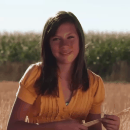</td>
      <td style="border: none"></td>
      <td style="border: none"></td>
      <td style="border: none"></td>
      <td style="border: none">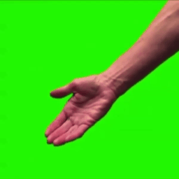</td>
      <td style="border: none"></td>
      </tr>
      <tr style="line-height: 0">
      <td colspan="1" style="border: none; text-align: center">GT</td> <td colspan="1" style="border: none; text-align: center">Ours</td>
      <td colspan="1" style="border: none; text-align: center">GT</td> <td colspan="1" style="border: none; text-align: center">Ours</td>
      <td colspan="1" style="border: none; text-align: center">GT</td> <td colspan="1" style="border: none; text-align: center">Ours</td>
      </tr>
      <td style="border: none">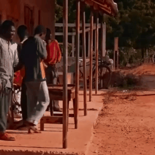</td>
      <td style="border: none"></td>
      <td style="border: none"></td>
      <td style="border: none"></td>
      <td style="border: none">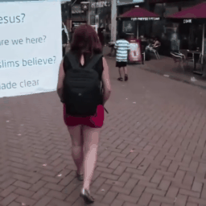</td>
      <td style="border: none"></td>
      </tr>
  </table>

### *Animals*
<table class="center">
      <tr style="line-height: 0">
      <td colspan="1" style="border: none; text-align: center">GT</td> <td colspan="1" style="border: none; text-align: center">Ours</td>
      <td colspan="1" style="border: none; text-align: center">GT</td> <td colspan="1" style="border: none; text-align: center">Ours</td>
      <td colspan="1" style="border: none; text-align: center">GT</td> <td colspan="1" style="border: none; text-align: center">Ours</td>
      </tr>
      <td style="border: none">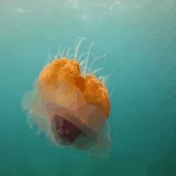</td>
      <td style="border: none"></td>
      <td style="border: none"></td>
      <td style="border: none"></td>
      <td style="border: none">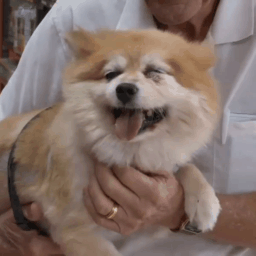</td>
      <td style="border: none">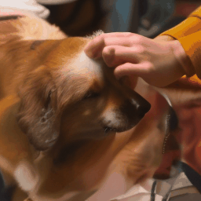</td>
      </tr>
      <tr style="line-height: 0">
      <td colspan="1" style="border: none; text-align: center">GT</td> <td colspan="1" style="border: none; text-align: center">Ours</td>
      <td colspan="1" style="border: none; text-align: center">GT</td> <td colspan="1" style="border: none; text-align: center">Ours</td>
      <td colspan="1" style="border: none; text-align: center">GT</td> <td colspan="1" style="border: none; text-align: center">Ours</td>
      </tr>
      <td style="border: none"></td>
      <td style="border: none">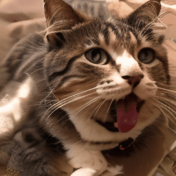</td>
      <td style="border: none"></td>
      <td style="border: none"></td>
      <td style="border: none"></td>
      <td style="border: none"></td>
      </tr>
  </table>

### *Traffic*
<table class="center">
      <tr style="line-height: 0">
      <td colspan="1" style="border: none; text-align: center">GT</td> <td colspan="1" style="border: none; text-align: center">Ours</td>
      <td colspan="1" style="border: none; text-align: center">GT</td> <td colspan="1" style="border: none; text-align: center">Ours</td>
      <td colspan="1" style="border: none; text-align: center">GT</td> <td colspan="1" style="border: none; text-align: center">Ours</td>
      </tr>
      <td style="border: none"></td>
      <td style="border: none"></td>
      <td style="border: none">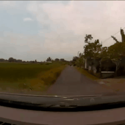</td>
      <td style="border: none"></td>
      <td style="border: none"></td>
      <td style="border: none"></td>
  </table>

### *Natural Scene*
<table class="center">
      <tr style="line-height: 0">
      <td colspan="1" style="border: none; text-align: center">GT</td> <td colspan="1" style="border: none; text-align: center">Ours</td>
      <td colspan="1" style="border: none; text-align: center">GT</td> <td colspan="1" style="border: none; text-align: center">Ours</td>
      <td colspan="1" style="border: none; text-align: center">GT</td> <td colspan="1" style="border: none; text-align: center">Ours</td>
      </tr>
      <td style="border: none">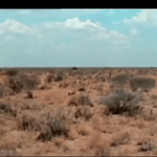</td>
      <td style="border: none"></td>
      <td style="border: none"></td>
      <td style="border: none"></td>
      <td style="border: none"></td>
      <td style="border: none"></td>
  </table>

### *Multi-fMRI Fusion*

<video controls>
<source src="assets/samples/multi-fmri.mp4" type="video/mp4">
</video>

## Fail Cases
Overall the fail cases can be divided into two categories: on the one hand, the semantics are not accurate enough and on the other hand, the scene transition affects the generated results.
### *Pixel Control & Semantic Deficit*
In CC2017 dataset, the video clips in the testing movie were different from those in the training movie, and there were even some categories of objects that didn't appear in the training set.
<table class="center">
      <tr style="line-height: 0">
      <td colspan="1" style="border: none; text-align: center">GT</td> <td colspan="1" style="border: none; text-align: center">Ours</td>
      <td colspan="1" style="border: none; text-align: center">GT</td> <td colspan="1" style="border: none; text-align: center">Ours</td>
      </tr>
      <td style="border: none"></td>
      <td style="border: none"></td>
      <td style="border: none"></td>
      <td style="border: none"></td>
  </table>

### *Scene Transitions*
<table class="center">
      <tr style="line-height: 0">
      <td colspan="1" style="border: none; text-align: center">GT</td> <td colspan="1" style="border: none; text-align: center">Ours</td>
      <td colspan="1" style="border: none; text-align: center">GT</td> <td colspan="1" style="border: none; text-align: center">Ours</td>
      </tr>
      <td style="border: none"></td>
      <td style="border: none"></td>
      <td style="border: none"></td>
      <td style="border: none">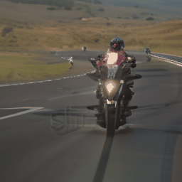</td>
  </table>